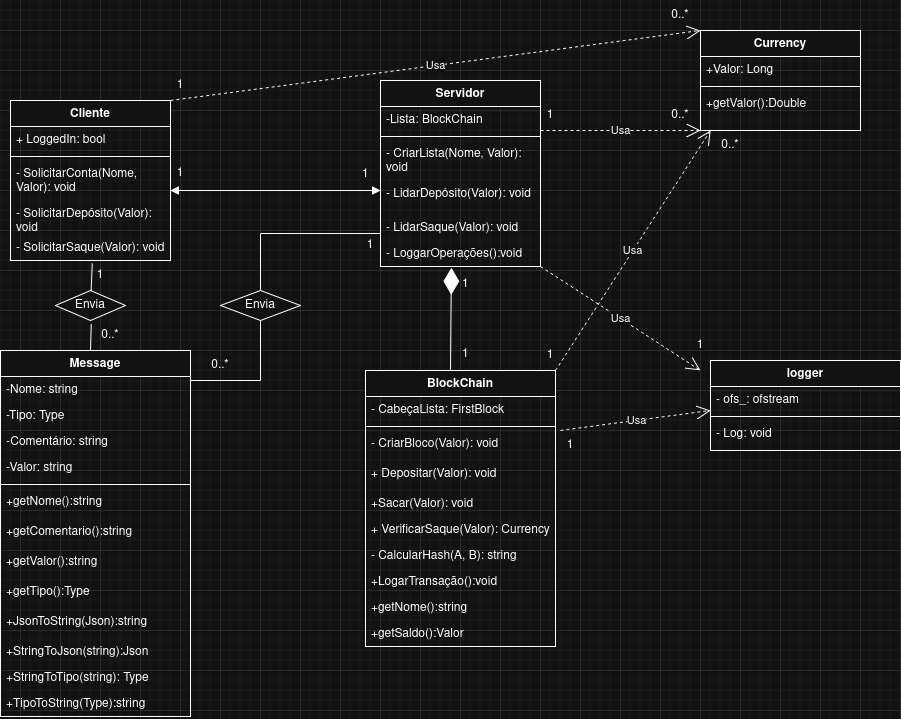

## Introdução

Esse projeto é a implementação do trabalho prático de Redes 2 (Professor Elias, 2025 Segundo Semestre). O projeto consiste em um sistema simples de cliente-servidor responsável por operar uma conta financeira para o cliente. Para isso, o servidor implementa uma espécie de blockchain, em que cada bloco da cadeia guarda as transações da conta e seu hash, de tal forma que o hash do bloco invariavelmente depende do bloco anterior por causa dele.

O projeto foi feito em C++ com a biblioteca Drogon para a comunicação via WebSocket. Os pormenores da implementação serão explicados abaixo.

## Rodar projeto

```
make
make s  // Rodar servidor
make c  // Rodar cliente
```

## Comportamento e Funcionalidades

O sistema permite que o cliente faça depósitos e retiradas de valores. A API do cliente solicita essas funcionalidades ao servidor, que manipula a blockchain para executar cada tarefa. Em caso de depósito, a blockchain cria um novo bloco indicando tal transação, calcula o novo hash e adiciona o bloco na lista. Já em caso de retirada, a blockchain primeiro varre o histórico de transações para verificar se há dinheiro suficiente na conta e adiciona um bloco indicando a transação se possível (o cliente é informado se o saque não for possível, juntamente ao saldo em sua conta). Cada atividade é registrada pelo servidor em forma de logs, que são gerados na pasta `logs/`, e neles é possível observar o funcionamento do sistema.

Importante notar também que a blockchain é persistente enquanto o servidor estiver no ar. Caso o cliente caia e se reconecte, ele checa primeiro se a conta já está criada ao invés de criar uma nova, e opera em cima dela.

## Framework

O Drogon é um framework para C++ que é portátil, rápido, assíncrono e operável em multithread. Ele opera criando três funções básicas: `handleConnection`, `handleNewMessage`, `handleConnectionClosed`, que são chamadas naturalmente pelo framework quando necessário. Resta ao programador construir a lógica em cima delas. Por baixo dos panos, o Drogon executa o protocolo WebSocket sobre o TCP, com um overhead menor que algumas conexões half-duplex como HTTP.

## Protocolo

O sistema comunica por meio de um protocolo baseado em JSON. O campo `Type`, com vários possíveis enums, é essencial para que o cliente e o servidor executem operações condizentes. Vale notar que o Drogon envia suas mensagens como strings, então o sistema transforma o JSON em string e vice-versa para haver comunicação.

##### Exemplo:
{
    "name": "Augusto",
    "value": 100,
    "comment": "Depósito inicial",
    "type": "INIT"
}


## Operação

Quando o cliente inicia, é enviada uma mensagem do tipo `LOGGEDIN` para verificar com o servidor se já há uma conta criada. Caso haja, ele passa a operar com ela; porém, se não for o caso, ele solicita ao usuário um nome e um depósito inicial e envia uma mensagem do tipo `INIT` para que o servidor crie a blockchain.

A partir disso, o cliente pode enviar mensagens do tipo `DEPOSIT` ou `WITHDRAW` para fazer depósitos ou saques, respectivamente — ao que o servidor pode responder com `SUCCESS` ou `REFUSED`, a depender da situação.



## Blockchain

A blockchain é implementada como uma classe Singleton, ou seja, só é possível uma instância dela no sistema, e ela persistirá enquanto o servidor estiver de pé. Quando a blockchain é criada, seu primeiro bloco armazena o nome do usuário, o depósito inicial, o horário em que a conta foi criada e um hash sobre essas três informações. Os blocos seguintes armazenam uma transação (positiva em caso de depósito e negativa em caso de saque) e um hash baseado na transação e no hash do bloco anterior.

A blockchain não salva o saldo da conta em lugar algum. Ela, na verdade, percorre a lista somando as transações para verificar o saldo. Isso garante a integridade do valor. Se uma tentativa de saque for maior que o valor na conta, um erro será emitido.

### Hash

A função hash utilizada é a padrão do C++: `std::hash()`. Contudo, para combinarmos os hashes existe a seguinte função:

```cpp
size_t BlockChain::combineHash(size_t h1, size_t h2) {  
    return h1 ^ (h2 + 0x9e3779b9 + (h1 << 6) + (h1 >> 2));
}
```

Essa é a implementação da técnica de combinação de hash proposta por Bob Jenkins. O valor `0x9e3779b9` é uma constante derivada da proporção áurea.


